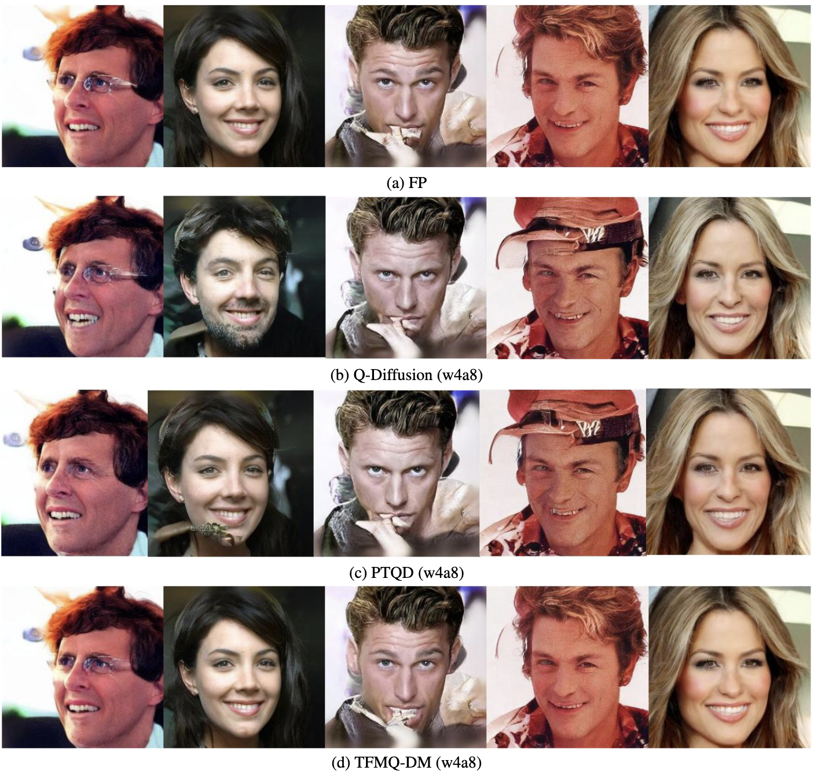
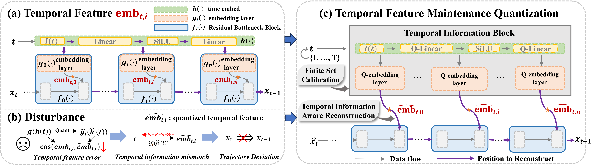

# TFMQ-DM: Temporal Feature Maintenance Quantization for Diffusion Models
<div align="center">
	
[](https://opensource.org/licenses/Apache-2.0) 
[](https://arxiv.org/abs/2311.16503)
[](https://arxiv.org/abs/2407.19547)
[](https://github.com/ModelTC/TFMQ-DM)

**[[conference](https://arxiv.org/abs/2311.16503) | [journal](https://arxiv.org/abs/2407.19547) | [slides](assets/slides.pdf) | [poster](assets/poster.pdf) | [project page](https://modeltc.github.io/TFMQ-DM/)]**

[Yushi Huang*](https://github.com/Harahan), [Ruihao Gong*](https://xhplus.github.io/), [Jing Liu](https://jing-liu.com/), [Tianlong Chen](https://tianlong-chen.github.io/), [Xianglong Liu📧](https://xlliu-beihang.github.io/)

(* denotes equal contribution, 📧 denotes corresponding author.)

</div>

This is the official implementation of our paper [TFMQ-DM](https://arxiv.org/abs/2311.16503), a  novel training-free framework that achieves a new state-of-the-art result in PTQ of diffusion models, especially under 4-bit weight quantization, and significantly accelerates quantization time. For some hard tasks, e.g., CelebA-HQ, our method reduces the FID score by 6.7.
<div align=center>
	<figure class="second">
	    
	</figure>
</div>

(Left) Images generated by w4a8 quantized and full-precision Stable Diffusion with MS-COCO captions. (Right) Random samples from w4a8 quantized and full-precision LDM-4 on CelebA-HQ. These results show that our TFMQ-DM outperforms the previous PTQ methods.  More qualitative and quantitative results can be found in our paper.

## News

* **Jun 17, 2025**: 🌟 Our journal paper has been accepted by TPAMI 2025! 🎉 Cheers!

* **Apr 5, 2024**: 🌟 Our paper has been selected as a **Highlight Poster** at CVPR 2024 **(top 2.8%)**! 🎉 Cheers!

* **Mar 31, 2024**: 🔥 We release our Python code for quantizing all the models presented in our paper. Have a try!

* **Feb 27, 2024**: 🌟 Our paper has been accepted by CVPR 2024! 🎉 Cheers!

## Overview



The Diffusion model, a prevalent framework for image generation, encounters significant challenges in terms of broad applicability due to its extended inference times and substantial memory requirements. Efficient Post-training Quantization (PTQ) is pivotal for addressing these issues in traditional models. Different from traditional models, diffusion models heavily depend on the time-step $t$ to achieve satisfactory multi-round denoising. Usually, $t$ from the finite set \{ $1, \ldots, T$ \} is encoded to a temporal feature by a few modules irrespective of the sampling data. However, existing PTQ methods do not optimize these modules separately. They adopt inappropriate reconstruction targets and complex calibration methods, resulting in a severe disturbance of the temporal feature and denoising trajectory, as well as a low compression efficiency. To solve these, we propose a Temporal Feature Maintenance Quantization (TFMQ) framework building upon a Temporal Information Block which is just related to the time-step $t$ and unrelated to the sampling data. Powered by the pioneering block design, we devise temporal information aware reconstruction (TIAR) and finite set calibration (FSC) to align the full-precision temporal features in a limited time. Equipped with the framework, we can maintain the most temporal information and ensure the end-to-end generation quality. Extensive experiments on various datasets and diffusion models prove our state-of-the-art results. 

## Quick Start

After cloning the repository, you can follow these steps to complete the model's quantization inference process.

### Requirements

```bash
conda env create -f ./stable-diffusion/environment.yaml
conda activate ldm
pip install -r requirements.txt
```

If you encounter errors while installing the packages listed in requirements.txt, you can try installing each Python package individually using the pip command.

Before quantization, you need to download the pre-trained weights (preliminary checkpoints):

```bash
# ----------- DDIM -----------
# The model execution script will automatically download the required checkpoints during runtime.

# ----------- LDM ------------
cd ./stable-diffusion/
sh ./scripts/download_first_stages.sh
sh ./scripts/download_models.sh
mkdir -p models/ldm/cin256-v2/
wget -O models/ldm/cin256-v2/model.ckpt https://ommer-lab.com/files/latent-diffusion/nitro/cin/model.ckpt
cd ../

# ----- Stable Diffusion -----
wget https://huggingface.co/CompVis/stable-diffusion-v-1-4-original/resolve/main/sd-v1-4.ckpt
mkdir -p ./stable-diffusion/models/ldm/stable-diffusion-v1/
mv sd-v1-4.ckpt ./stable-diffusion/models/ldm/stable-diffusion-v1/sd-v1-4.ckpt
```

### Quantization

In this part, we will first generate some calibration data before quantizing. Alternatively, you can generate calibration data separately by adding `torch.save` in the script, and quantize when needed by adding `torch.load` and commenting out the code for generating calibration data.

If you want to quantize your diffusion models on multiple GPUs, add `--multi_gpu` to the corresponding command, except for `DDIM`. Additionally, you can remove `--use_aq`，`--aq 8` to cancel activation quantization.

Additionally, before quantizing Stable Diffusion, you still need to prepare some prompts. For example, you can download [MS-COCO](https://cocodataset.org/#download), and use the path of `captions_train*.json` as `<PATH/TO/LOAD/DATA>` in the following command. We would use 128 prompts within `captions_train*.json` as a part of the calibration data.

```bash
# ----------- DDIM -----------
python sample_diffusion_ddim.py --config ddim/configs/cifar10.yml --timesteps 100 --eta 0 --skip_type quad --wq <4 OR 8> --ptq --aq 8 -l <PATH/TO/SAVE/LOG> --cali --use_aq --cali_save_path <PATH/TO/SAVE/QUANTIZED/MODEL> --interval_length 5

# ----------- LDM ------------
# LSUN-Bedrooms
python sample_diffusion_ldm.py -r ./stable-diffusion/models/ldm/lsun_beds256/model.ckpt -c 200 -e 1.0 --seed 40 --wq <4 OR 8> --ptq --aq 8 -l <PATH/TO/SAVE/LOG> --cali --use_aq --cali_save_path <PATH/TO/SAVE/QUANTIZED/MODEL> --interval_length 10
# LSUN-Churches
python sample_diffusion_ldm.py -r ./stable-diffusion/models/ldm/lsun_churches256/model.ckpt -c 400 -e 0.0 --seed 40 --wq <4 OR 8> --ptq --aq 8 -l <PATH/TO/SAVE/LOG> --cali --use_aq --cali_save_path <PATH/TO/SAVE/QUANTIZED/MODEL> --interval_length 25
# CelebA-HQ
python sample_diffusion_ldm.py -r ./stable-diffusion/models/ldm/celeba256/model.ckpt -c 200 -e 0.0 --seed 40 --wq <4 OR 8> --ptq --aq 8 -l <PATH/TO/SAVE/LOG> --cali --use_aq --cali_save_path <PATH/TO/SAVE/QUANTIZED/MODEL> --interval_length 10
# FFHQ
python sample_diffusion_ldm.py -r ./stable-diffusion/models/ldm/ffhq256/model.ckpt -c 200 -e 1.0 --seed 40 --wq <4 OR 8> --ptq --aq 8 -l <PATH/TO/SAVE/LOG> --cali --use_aq --cali_save_path <PATH/TO/SAVE/QUANTIZED/MODEL> --interval_length 10
# ImageNet
python latent_imagenet_diffusion.py -e 0.0 --ddim_steps 20 --scale 3.0 --seed 40 --wq <4 OR 8> --ptq --aq 8 --outdir <PATH/TO/SAVE/LOG> --cali --use_aq --cali_save_path <PATH/TO/SAVE/QUANTIZED/MODEL>

# ----- Stable Diffusion -----
python txt2img.py --plms --no_grad_ckpt --ddim_steps 50 --seed 40 --cond --wq <4 OR 8> --ptq --aq 8 --outdir <PATH/TO/SAVE/LOG> --cali --skip_grid --use_aq --ckpt ./stable-diffusion/models/ldm/stable-diffusion-v1/sd-v1-4.ckpt --config stable-diffusion/configs/stable-diffusion/v1-inference.yaml --data_path <PATH/TO/LOAD/DATA> --cali_save_path <PATH/TO/SAVE/QUANTIZED/MODEL>
```

### Inference

After the quantization process, you can generate images you like. You can remove `--use_aq`，`--aq 8` to cancel activation quantization.

```bash
# ----------- DDIM -----------
python sample_diffusion_ddim.py --config ddim/configs/cifar10.yml --timesteps 100 --eta 0 --skip_type quad --wq <4 OR 8> --ptq --aq 8 -l <PATH/TO/SAVE/RESULT> --use_aq --cali_ckpt <PATH/TO/LOAD/QUANTIZED/MODEL> --max_images 128

# ----------- LDM ------------
# LSUN-Bedrooms
python sample_diffusion_ldm.py -r ./stable-diffusion/models/ldm/lsun_beds256/model.ckpt -c 200 -e 1.0 --seed 40 --wq <4 OR 8> --ptq --aq 8 -l <PATH/TO/SAVE/RESULT> --use_aq --cali_ckpt <PATH/TO/LOAD/QUANTIZED/MODEL> -n 5 --batch_size 5
# LSUN-Churches
python sample_diffusion_ldm.py -r ./stable-diffusion/models/ldm/lsun_churches256/model.ckpt -c 400 -e 0.0 --seed 40 --wq <4 OR 8> --ptq --aq 8 -l <PATH/TO/SAVE/RESULT> --use_aq --cali_ckpt <PATH/TO/LOAD/QUANTIZED/MODEL> -n 5 --batch_size 5
# CelebA-HQ
python sample_diffusion_ldm.py -r ./stable-diffusion/models/ldm/celeba256/model.ckpt -c 200 -e 0.0 --seed 40 --wq <4 OR 8> --ptq --aq 8 -l <PATH/TO/SAVE/RESULT> --use_aq --cali_ckpt <PATH/TO/LOAD/QUANTIZED/MODEL> -n 5 --batch_size 5
# FFHQ
python sample_diffusion_ldm.py -r ./stable-diffusion/models/ldm/ffhq256/model.ckpt -c 200 -e 1.0 --seed 40 --wq <4 OR 8> --ptq --aq 8 -l <PATH/TO/SAVE/RESULT> --use_aq --cali_ckpt <PATH/TO/LOAD/QUANTIZED/MODEL> -n 5 --batch_size 5
# ImageNet
python latent_imagenet_diffusion.py -e 0.0 --ddim_steps 20 --scale 3.0 --seed 40 --wq <4 OR 8> --ptq --aq 8 --outdir <PATH/TO/SAVE/RESULT>  --use_aq --cali_ckpt <PATH/TO/LOAD/QUANTIZED/MODEL> --n_sample_per_class 2 --classes <CLASSES. e.g. 7,489,765>

# ----- Stable Diffusion -----
python txt2img.py --prompt <PROMPT. e.g. "A white dog."> --plms --no_grad_ckpt --ddim_steps 50 --seed 40 --cond --n_iter 1 --n_samples 1 --wq <4 OR 8> --ptq --aq 8 --skip_grid --outdir <PATH/TO/SAVE/RESULT> --use_aq --ckpt ./stable-diffusion/models/ldm/stable-diffusion-v1/sd-v1-4.ckpt --config stable-diffusion/configs/stable-diffusion/v1-inference.yaml --cali_ckpt <PATH/TO/LOAD/QUANTIZED/MODEL>
```

## Acknowledgments

Our code was developed based on [ddim](https://github.com/ermongroup/ddim), [latent-diffusion](https://github.com/CompVis/latent-diffusion) and [stable-diffusion](https://github.com/CompVis/stable-diffusion). We referred to [BRECQ](https://github.com/yhhhli/BRECQ) and [Q-Diffusion](https://github.com/Xiuyu-Li/q-diffusion) for the blockwise calibration implementation.

We thank [OpenVINO](https://github.com/openvinotoolkit/openvino) for providing the framework to deploy our quantized model and measure acceleration. Moreover, we also thank [torch-fidelity](https://github.com/toshas/torch-fidelity), [guided-diffusion](https://github.com/openai/guided-diffusion), and [clip-score](https://github.com/Taited/clip-score) for IS, sFID, FID, and CLIP score computation.

## Citation

If you find our TFMQ-DM or Temporal Feature Matters useful or relevant to your research, please kindly cite our paper:

```
@article{Huang_2025_TPAMI,
    title={Temporal Feature Matters: A Framework for Diffusion Model Quantization},
    author={Yushi Huang and Ruihao Gong and Xianglong Liu and Jing Liu and Yuhang Li and Jiwen Lu and Dacheng Tao},
    journal={IEEE Transactions on Pattern Analysis and Machine Intelligence},
    year={2025},
}

@InProceedings{Huang_2024_CVPR,
    author    = {Huang, Yushi and Gong, Ruihao and Liu, Jing and Chen, Tianlong and Liu, Xianglong},
    title     = {TFMQ-DM: Temporal Feature Maintenance Quantization for Diffusion Models},
    booktitle = {Proceedings of the IEEE/CVF Conference on Computer Vision and Pattern Recognition (CVPR)},
    month     = {June},
    year      = {2024},
    pages     = {7362-7371}
}
```
